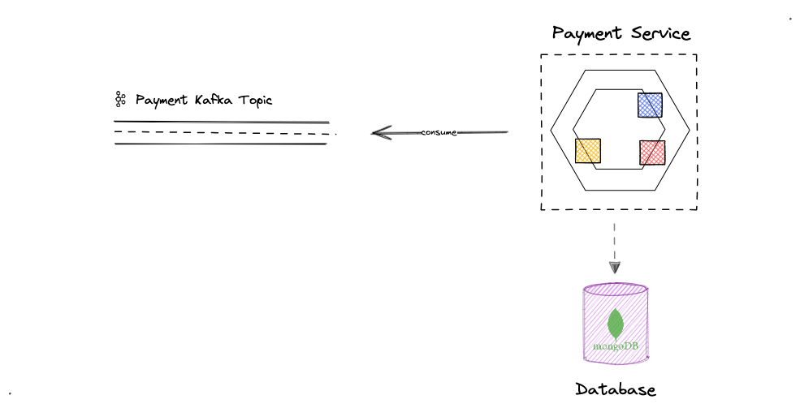

# Microservice

> Demo (Handle Kafka & Mongo)

## About

this project uses [SpringBoot 3](https://spring.io/guides/gs/spring-boot/) that helps creating production-grade and
stand-alone java applications & services with absolute minimum fuss.

> This project implements a **Payment Service** using hexagonal architecture.
  The service consumes messages from a Kafka topic, validates and stores them in a MongoDB database.

## Architecture

The Payment Service follows the hexagonal (or ports/adapter) architecture:

- **Core Domain**: Contains the business logic and domain models.
- **Ports**: Define interfaces for incoming and outgoing interactions.
- **Adapters**: Implement the interfaces defined by the ports.

<div >
  
  <p><em>Payment Service Architecture</em></p>
</div>


## Project Structure
```
src/
    |-- common/
    |   |-- event/ #
    |   |-- exception/
    |
    |-- config/
    |   |-- kafka/
    |   |-- mongodb/
    |
    |-- core/
        |-- api/messaging/
        |   |-- model/ 
        |   |-- KafkaConsumer.java
        |
        |-- domain/
        |   |-- model/
        |   |-- port/
        |   |  |-- payment-gateways #interfaces
        |   |-- service/
        |
        |-- infra/
            |-- mongodb/
            |   |-- adapter/
            |   |-- model/ 
            |   |-- respository
    |
    |-- Application.java
    |
    test/
|
docker-compose.yml
start-local-env.sh
pom.xml
```


## Run Locally

### Prerequisites
. Java environment
```
> java -version
java 22
```
. Have `Maven` Installed
```
> mvn -version
Apache Maven 3.9.8
```

### Startup using CMD
```
mvn spring-boot:run
```

## Development with docker

Make sure that you have installed the following tools on your local machine
1. [Docker](https://docs.docker.com/install/#supported-platforms),
2. [docker-compose](https://docs.docker.com/compose/install/). (you should have version 1.29 or higher)
>  Installing [Docker Desktop](https://www.docker.com/products/docker-desktop) (for Mac & Windows) is the easiest way to get your environment ready

### Set up MongoDB cluster & Kafka Broker

A script that automates the process was provided ;)

```shell
./start-local-env.sh
```

#### After running the script
Once the script completes successfully:

MongoDB cluster will be available at `mongodb://localhost:27017,localhost:27018,localhost:27019/test?replicaSet=rs0`
Kafka broker will be accessible at `localhost:9092`


In order for your machine to recognize the hosts mongo1, mongo2, and mongo3, you must add these hostnames to your local hosts file as follows:
```
127.0.0.1       mongo1
127.0.0.1       mongo2
127.0.0.1       mongo3
```

The location of the hosts file varies by operating system:
- For macOS: /private/etc/hosts
- For Windows: C:/Windows/System32/drivers/etc/hosts

> Note : We need to create a Mongo Replica Set in order to be able to test some promising features like @Transactional annotation, etc

 

-----

######  Access the MongoDB cluster
[Compass](https://www.mongodb.com/products/compass) is an interactive tool for querying,
optimizing, and analyzing the MongoDB data


The Connection String URI Format For our Replica Set is as the following
```
mongodb://localhost:27017,localhost:27018,localhost:27019/?replicaSet=rs0
```


###### Visualize kafka cluster


[Offset Explorer](https://www.kafkatool.com/) is one of the best kafka UI tool that allow to quickly view our kafka cluster, including the borkers, topics and consumers
1. Download & Install Offset Explorer
2. Launch the app & Add a New Connection
3. In the **Advanced tab** : `Boostrap servers : localhost:9092`

>  you can use [Conduktor](https://www.conduktor.io/) which is a beautiful and fully-featured desktop client for Apache Kafka


## Testing

🚀 This project includes simple unit tests and integration tests to ensure the reliability and correctness of the payment service as it evolves

##### Unit Tests:
Example: PaymentServiceTest.java

tests individual components in isolation.

--

##### Integration Tests:
Example: `PaymentTestIT.java`

It tests the entire payment processing flow.

> The integration test utilizes spring-kafka-test with an embedded Kafka broker and embedded MongoDB instance to simulate the production environment.


---
---

Feel free to open an issue or submit a pull request if you have any suggestions or improvements!
